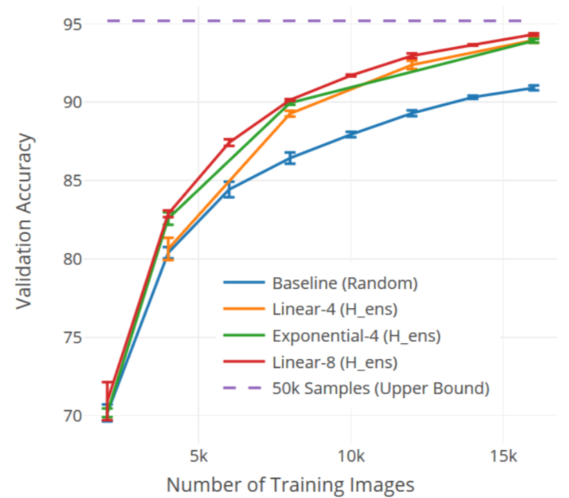

# Large-Scale Visual Active Learning with Deep Probabilistic Ensembles

关键概念：

- ensemble models
- Acquisition function
- L2 regularization

## 一些问题

- L2 regularization 具体什么作用？以前理解可以防止过拟合（why?），这里的regularization的作用？
- Ensemble model是怎么训练的？看loss是一起训练然后一起优化？segmentation比较好理解，Classification呢？

## 简介

本文介绍了一种新的uncertainty建模方法：Deep Probabilistic Ensembles(DPEs)。这种方法的核心是用KL regularization训练ensemble models，这种方式可以近似BNN的Variational inference。通过在三个不同数据集上的实验证明，DPEs AL的效果相比于baseline(AL with random sampling)，sota AL都有提升。当迁移到大数据、大模型时，这个效果提升依然成立。当迁移到segmentation任务时，我们发现有20%的IOU提升

## Active Image Classification

- 数据集：CIFAR10k， CIFAR100k， ImageNet

- Network : resnet_18

- Loss：

- Acquisition function

  - random
  - Catogory first entropy（H_cat)
  - Mutual Information : H_ens  - H_cat 
    - 被证明能够把epistemic uncertainty和随机不确定区分开来，（只建模pistemic uncertainty的意思？）
  - Variance也是主要用来建模epistemic uncertainty的
  - Variance ratio可以认为是离散版的Variance，描述的是不一致预测结果数，指的是ensemble中和大多数预测结果不一致的预测结果的数量。

- L2 regularity

- 实验结果

  

  在CIFAR-10上的实验结果：

  - 虚线是使用所有数据训练达到的accuracy上界
  - 

  

