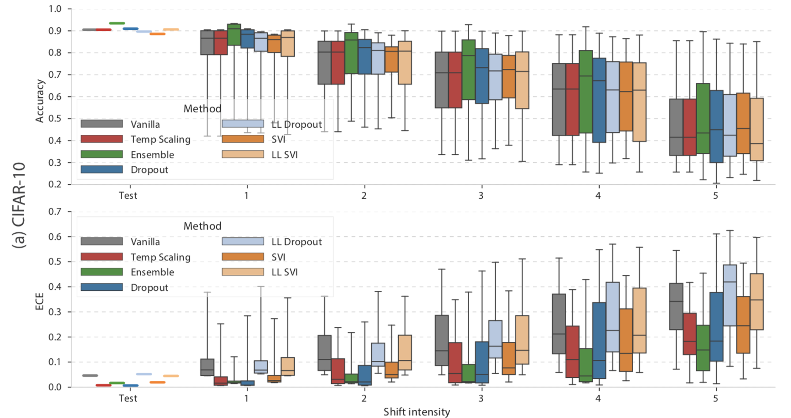
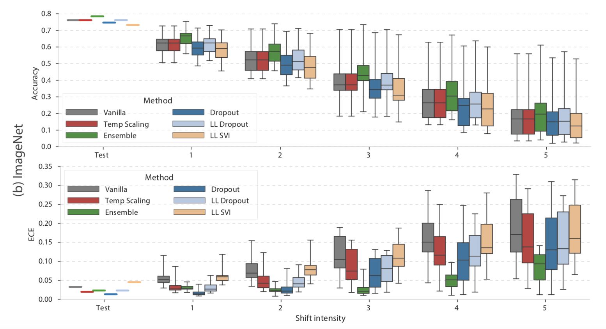

# 论文笔记：Can You Trust Your Model’s Uncertainty? Evaluating Predictive Uncertainty Under Dataset Shift

> NIPS2019
>
> Yaniv Ovadia Google Research  yovadia@google.com
>
> ……

## 简介

论文主要关注classification的uncertainty，作者比较了7种不同的uncertainty计算方式，并提出一种benchmarking方法，用不同的metric来衡量这些uncertainty的优劣。结果证明，ensemble是最优uncertainty estimation方法。

- 2 kinds of shift
  - shifted input（GT仍然是训练集中k类中的一类）
  - OOD（out of distribution）没有见多的样本，其GT也不在训练集类别中
- 

## uncertainty estimation

下面介绍一些uncertainty建模计算方法（分类问题）：

- (*Vanilla*) Maximum softmax probability (Hendrycks & Gimpel, 2017)

  去softmax层的最大prob作为uncertainty

- (*Temp Scaling*) Post-hoc calibration by temperature scaling using a validation set (Guo et al., 2017)

  

- (*Dropout*) Monte-Carlo Dropout (Gal & Ghahramani, 2016; Srivastava et al., 2015) with rate p

- (*Ensembles*) Ensembles of M networks trained independently on the entire dataset using random initialization (Lakshminarayanan et al., 2017) (we set M = 10 in experiments below)

- (*SVI*) Stochastic Variational Bayesian Inference for deep learning (Blundell et al., 2015; Graves, 2011; Louizos & Welling, 2017, 2016; Wen et al., 2018). We refer to Appendix A.6 for details of our SVI implementation.

- (LL) Approx. Bayesian inference for the parameters of the last layer only (Riquelme et al., 2018) – (*LL SVI*) Mean field stochastic variational inference on the last layer only

  – (*LL Dropout*) Dropout only on the activations before the last layer

## uncertainty metric

- NLL(Negative Log-likelihood) ：

  
  $$
  NLL = -\sum_{i=1}^N(y_i\log(p_i) + (1-y_i)\log(1-p_i))
  $$
  

  - 可以看出：
    - 当真实label=1， 预测结果趋向0时，$NLL=-\log(p)$趋向于无穷大
    - 当真实label=0， 预测结果趋向1时，$NLL=-\log(1-p)$趋向于无穷大
    - 而当两者越接近，NLL会越小
    - 在分类模型中，LR 模型通过优化Logloss来训练，所有LR模型是well-calibrated的。
  - 缺点：可能会过分强化tail probabilities（预测结果和真值不同时，prob特别高和特别低的，uncertainty都会比较高）【？？uncertainty estimation用到了真值？】

- Brier score

- ECE(Expected Calibration Error)
  - 
- $\tau$

