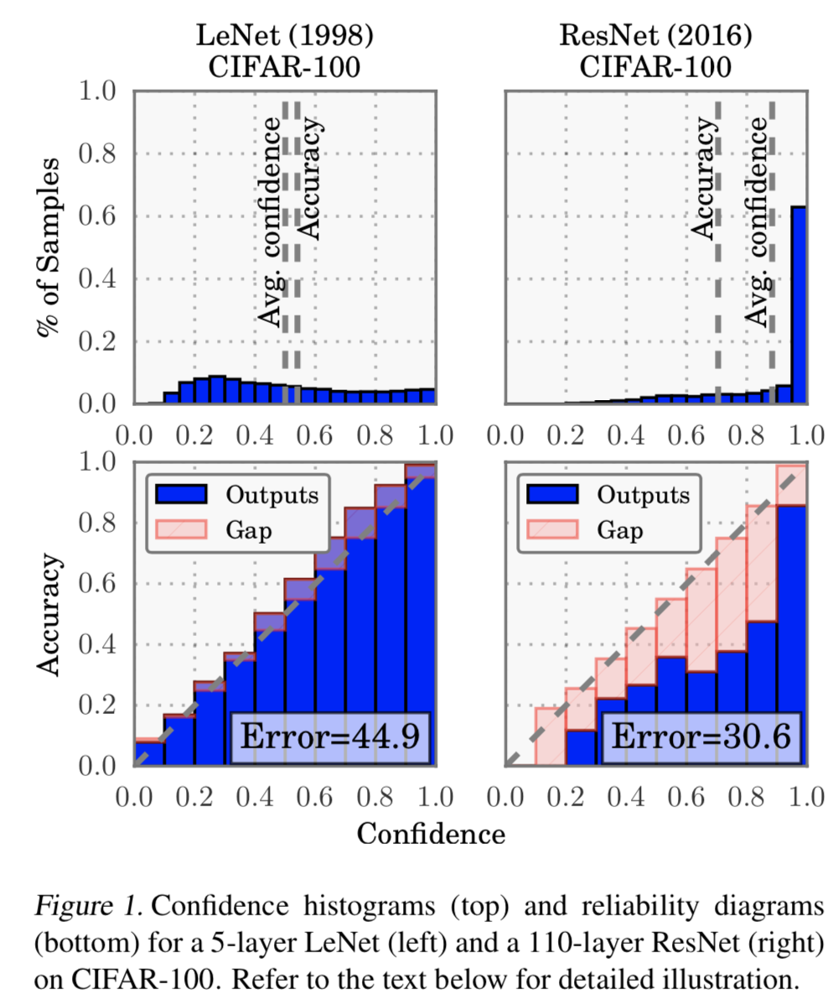

# On Calibration of Modern Neural Networks

## 问题

1. 为什么NN会miscalibrated? NN包含大量参数，很容易造成模型过于复杂而失去泛化性。表现在calibration上，就是loss下降了，但是ECE上升了。
2. 如何取消或者弱化这种情况？ 本文通过尝试多种后处理方法（假设train/val/test来自同样的数据分布），实现模型calibration。

## 重要概念

### Calibration metrics

- perfect calibration

  给N=100个预测结果，如果每个预测结果的conf=0.8，perfect calibration意味着接近N*=0.8=80个结果会是正确的（N越大，正确预测结果数，越接近0.8N）:
  $$
  \mathbb{P}(\hat{Y}=Y|\hat{P}=p)=p, \forall{p} \in [0,1]
  $$

- Reliability Diagram

  

上图中，bottom graph是 accuracy基于confidence的函数。Gap是实际acc和expected acc的差异。

把conf分为M个区间，定义$B_m$是预测结果conf落入第m个区间的sample ind的集合：
$$
acc(B_m) = \frac{1}{|B_m|}\sum_{i\in B_m}\mathbb{1}(\hat{y}_i = y_i)
$$

$$
conf（B_m) = \frac{1}{|B_m|}\sum_{i\in B_m}\hat{p}_i
$$

从 $acc(B_m)$ 和 $conf(B_m)$ 的差异，可以看出多少sample是well calibrated，多少不是

- Expected Calibrantion Error（ECE）

  calibration的统计结果，可以通过ECE给出：
  $$
  \mathbb{E}_{\hat{P}}[|\mathbb{P}(\hat{Y}=Y|\hat{P}=p) - p|]
  $$

  $$
  ECE = \sum_{m=1}^{M}\frac{|B_m|}{n}|acc(B_m) - conf(B_m)|
  $$

  <u>其中n是样本数？</u>

- Maximum Calibrantion Error（MCE）

### Calibration Method

本文介绍一些后处理Calibration方法，以生成caliibrated probability。这些方法大部分是非参数化的，少数是参数化，

### Calibrating Binary Models

二分类模型 calibration：模型输出logit$(z_i)$、prob($\hat{p}_i$)和cls_pred($y_i$)。我们的目标的希望得到calibrated_prob:
$$
\hat{q}_i = f(z_i,\hat{p}_i,y_i)
$$

- HIstogram binning

  把所有输出概率$\hat{p}_i$分为M（通常比较小）个区间，每个区间被分配一个**<u>calibrated score</u>** $\theta_m$. 如果输出概率落在该区间，则calibrated prob $q_i = \theta_m $.

  为得到$\theta_m$, 我们优化目标函数：
  $$
  \min_{\theta_1,...,\theta_M}\sum_{m=1}^M\sum_{i-1}
  $$
  

### Multiclass Models

## 结论

增加网络Depth、增加每层的conv数和使用BN，可以降低Error，但是会导致ECE上升。增加weight_decay可以在降低Error的同时降低ECE，具备更好的calibration效果。

对比多种calibration 方法，我们发现temperature scaling方法又快又好，还易于实现，是非常棒的calibration方法。

## 补充

- L2 regularization：在原始loss的基础上，添加包含参数$\theta$二维范数的项
  $$
  f_{t}^{reg}(\theta) = f_t(\theta) + \frac{\lambda^{'}}{2}||\theta||^2
  $$
  

- weight decay

  $\theta$ 更新：在每次更新梯度的时候减去，多减去$\lambda$的系数
  $$
  \theta_{t+1} = (1-\lambda)\theta_t - \alpha\bigtriangledown	f_t(\theta_t)
  $$
  
  $$
  L^*(\theta) = L(\theta) + \frac{\lambda}{2}||\theta||^2
  $$

  $$
  \frac{d L^*(\theta)}{d\theta} = \frac{dL(\theta)}{d\theta} + \lambda\theta
  $$

  

  
  $$
  \theta_{t+1} = \theta_{t} - \alpha\frac{dL^*(\theta_t)}{d\theta_t} = \theta_t - \alpha\frac{dL(\theta_t)}{d\theta_t} - \alpha\lambda\theta_t = (1-\alpha\lambda)\theta_t - \alpha\frac{dL(\theta_t)}{d\theta_t}
  $$
  **注：** 当使用SGD时，weight decay和L2 regularization等价，使用Adam时则不是。这就是为什么很多人用Adam优化器不如SGD的原因 -> AdamW.

  

