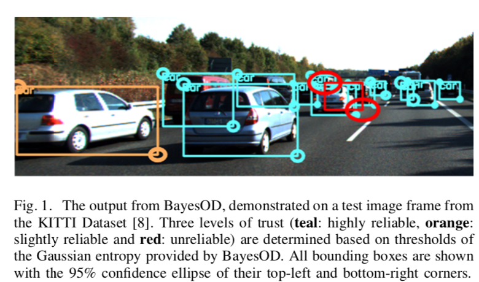
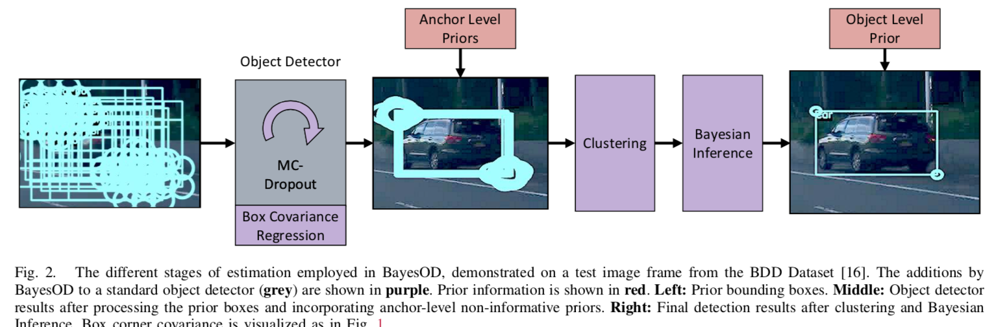

# BayesianOD

## 摘要

最近有不少detection uncertainty estimation的论文，但是这些论文提供的方法并不成功。原因主要有1）使用NMS导致信息损失 2）忽略了anchor_based检测器是多任务，many-to-one问题。

为了避免这些问题，本文提出Bayesian OD，重新构建推理阶段和NMS过程，实验证明BOD能够有效减少min Gaussian uncertainty error（-9.77% - 13.13% ），降低min Categorical uncertainty error 1.63% - 5.23%

这是BOD的输出，青色=高度可信，桔色：轻度可信，红色：不可信

## 贡献

- ？

- 把标准的NMS换成bayesian inference，使得最后的uncertainty包含了 bbox和category的信息

- 我们在四个数据集上实验，得到不错的结论

  

  

## 检测uncertainty estimation

如果用BNN来建模epistemic uncertainty，我们会假设模型参数 $\theta$ 服从先验分布 $p(\theta | \mathcal D)$ , 则marginal distribution为
$$
p(\hat y_i|x_i, \mathcal D) = \int_{\theta} p(\hat y_i|x_i, \mathcal D, \theta) p(\theta|\mathcal D ) d\theta
$$
其中，$x_i, y_i$ 分别是输入和输出。这方程是不可解的，之前的工作通过ensemble或者MC dropouut来近似

