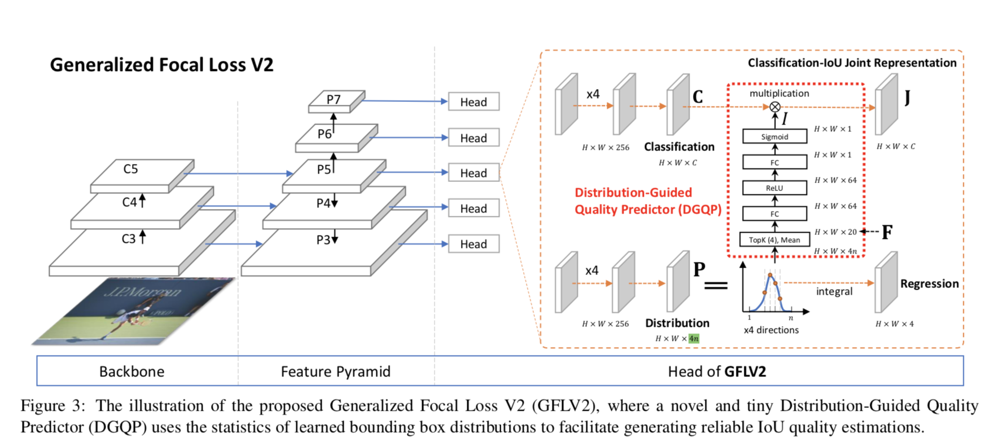
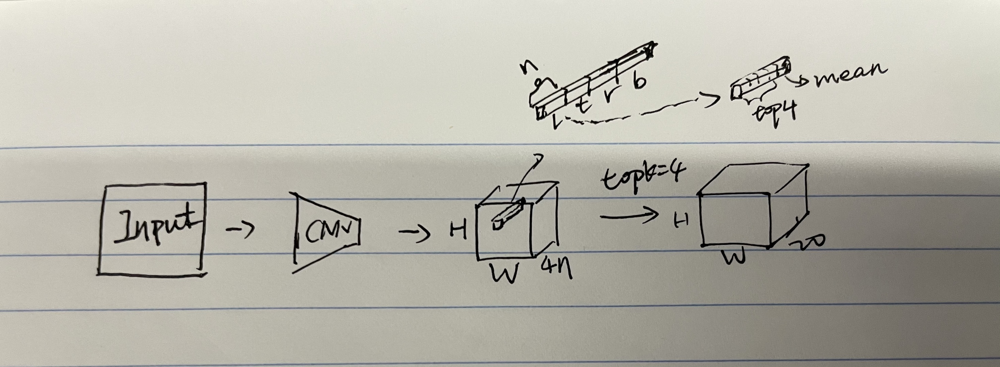

# 20210315 Generalized Focal Loss V2

## 摘要

## 问题

1. 这里的distribution是什么？box在各个方向（{l, t, r, b}）的topK distribution

2. 如何把distribution用于提升LQE(Localization Quality Estimation) ?

   

   首先让网络estimate一个box distribution（HxWx4n），然后基于这个distribution，取topk(k=4)和mean，得到HxWx20的statistical feature (F)，然后用一个light subnet学习 Cls-IoU Joint Representation。

   

   

3. 如何基于Quality Focal Loss监督学习J = C x I？(cls conf: $C\in[0,1]$, IoU: $I \in [0,1]$)

   

4. **Composed Form**和**Decomposed Form**的区别？

   

5. 这个网路结构的优势？

   无痛涨点

6. the consistency problema as mentioned in GFLV1？

   

7. 在推理的时候，cls-representation可以直接作为inference阶段的IOU？

   *有点奇怪，如果是和objectness score相乘比较合理吧？*

8. 因为discrete distribution的sum = 1，所以 topk的mean基本可以表示distribution的flateness：越小越flatten，越大越sharper？

   **对，核心是因为topk中的k比较小，所以sharp会对mean贡献比较大**

